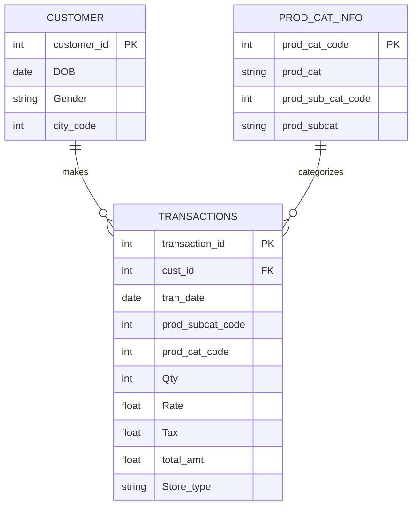

# SQL Retail Data Analysis
 

Tool used for analysis  : SQL

Data Availability

•	The data set for the analysis comprises of three tables

1.	Customer: Customer Demographics 
2.	Transactions: Customer Transaction Details
3.	Product Category: Product category and sub category information 

The following data schema explains relationship of the tables

Approach to the business problem

•	DATA PREPARATION AND UNDERSTANDING

1.	Getting the total number of rows in each of the three tables in the database to understand the tables and records 
2.	Counting the return transactions to Understand the true costs of returns and the potential opportunities to reduce these costs
3.	Understanding the time range of data for the analysis and many more

•	DATA ANALYSIS

1.	Identifying the most commonly used channel for transactions in order to adopt the best payment strategy for processing payments in stores would provide retailers with new possibilities to capture consumers' hearts.
2.	Demographic analysis - Counting the female and male customers, as men and women having different shopping preferences different strategies are needed to attract customers in stores 
3.	City wise sales summary to improve the sales strategies as city wise and many more.
